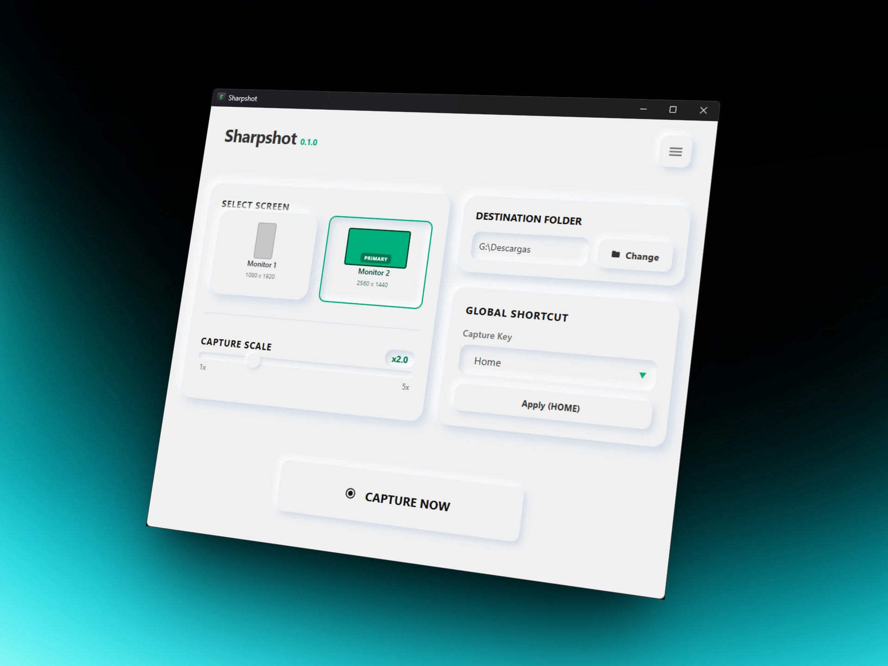
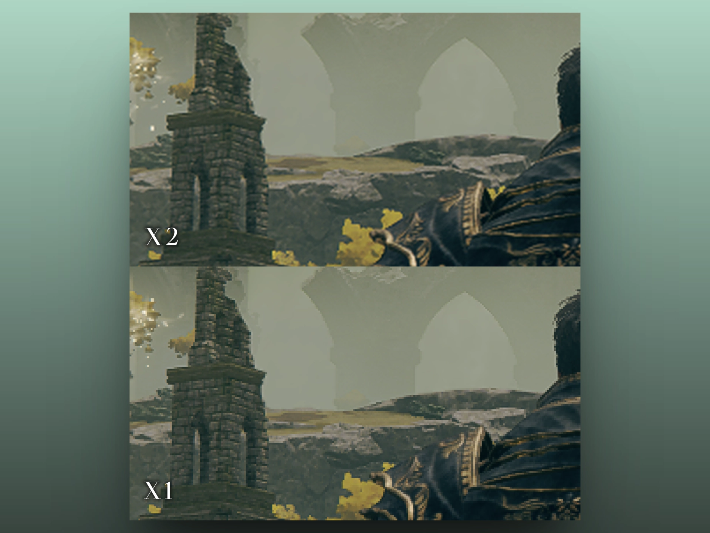

# Sharpshot



Sharpshot is a lightweight, high-performance screen capture app built with **Tauri**, **Vue 3**, and **Rust**. It delivers fast captures, a clean neumorphic UI, and advanced scaling so screenshots look crisp even when you need extra resolution.

From a single hotkey you can grab a full monitor, keep your preferred settings, and get subtle audio feedback that makes the flow feel instant.

## Features

- **High-Quality Scaling**: Capture screens at up to 5x their native resolution using Rust-powered image processing.
- **Global Shortcuts**: Register a system-wide hotkey (e.g., F12) to capture instantly.
- **Multi-Monitor Support**: Automatically detects all connected displays with primary monitor identification.
- **Neumorphic UI**: A modern, tactile interface with glassmorphism effects and smooth animations.
- **Persistence**: Remembers your preferred monitor, save path, global shortcut, and audio settings.
- **Audio Feedback**: Satisfying camera shutter sounds with adjustable volume and mute toggle.



## Tech Stack

- **Frontend**: Vue 3 (Composition API), TypeScript, Vite.
- **Backend**: Rust (Tauri v2).
- **Styling**: Pure CSS3 with Neumorphism and Glassmorphism patterns.

## Development

### Prerequisites
- [Rust](https://www.rust-lang.org/tools/install)
- [Node.js](https://nodejs.org/)
- OS-specific dependencies (see [Tauri's prerequisites](https://tauri.app/v1/guides/getting-started/prerequisites))

### Setup
1. Clone the repository.
2. Install dependencies:
   ```bash
   npm install
   ```
3. Run in development mode:
   ```bash
   npm run tauri dev
   ```
4. Build for production:
   ```bash
   npm run tauri build
   ```

## License

Distributed under the MIT License.
